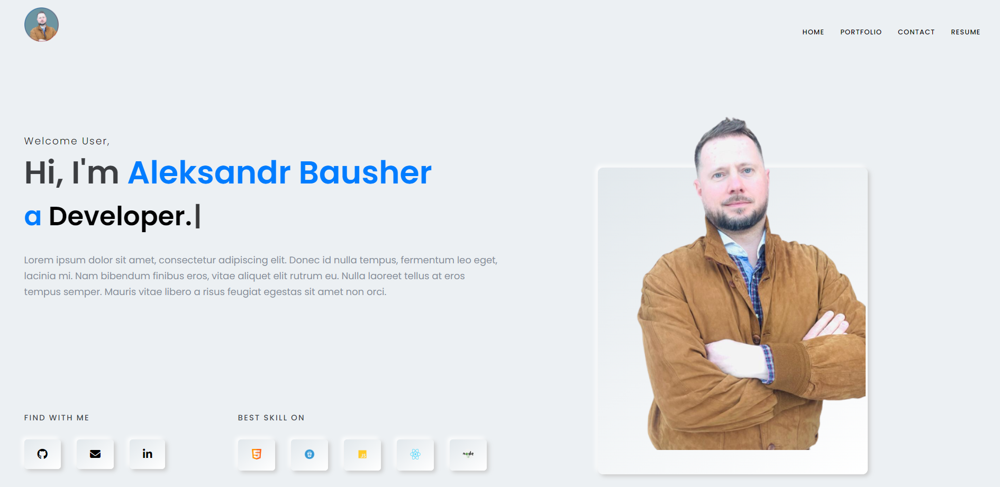

# Portfolio

## Description

A portfolio is a collection of work samples or accomplishments that showcase an individual's skills, experiences, and abilities. It serves as a visual representation of a person's professional or creative journey and provides evidence of their expertise in a particular field.

A well-crafted portfolio is carefully curated to highlight the most relevant and impressive projects, assignments, or achievements. It can be used by professionals, such as artists, designers, writers, photographers, and architects, to demonstrate their talent, creativity, and proficiency in their respective disciplines. Additionally, individuals in fields like marketing, business, or technology may also create portfolios to showcase their innovative projects, successful campaigns, or technical expertise.

The contents of a portfolio can vary depending on the industry and individual preferences. It typically includes samples of work, such as artwork, photographs, writing samples, design projects, code snippets, case studies, research papers, or even video presentations. Each piece is accompanied by a description or explanation that provides context, highlights key features, and demonstrates the individual's thought process and problem-solving abilities.

## Table of contents

- [Installation](#installation)
- [Usage](#usage)
- [Screenshots](#screenshots)
- [Contribution](#contribution)
- [Questions](#questions)
- [License](#license)

## Installation

Clone GitHub repository [Portfolio](https://github.com/AleksandrBausher/portfolio)
Run the command

```
npm i
```

and then

```
npm start
```

## Usage

Click here to access the deployed app [Portfolio](https://aleksandrbausher.github.io/portfolio)

## Screenshots



## Contribution

Application was created by Aleksandr Bausher and if you want to contribute send me email.

## Questions

My Email:
[aleksandrbausher@gmail.com](mailto:aleksandrbausher@gmail.com)
My Github:
[AleksandrBausher](https://github.com/aleksandrbausher)

## License

